# AI-Native Cloud-Native PaaS Architecture

## Architecture Overview

This document outlines the comprehensive architecture for an AI-native, cloud-native Platform-as-a-Service (PaaS) that adheres to MACH principles (Microservices, API-first, Cloud-native, Headless) with clean/hexagonal architecture patterns.

## Core Architectural Principles

### MACH Compliance
- **Microservices**: Event-driven, independently deployable services
- **API-first**: All functionality exposed through well-defined APIs
- **Cloud-native**: Built for cloud scalability and resilience
- **Headless**: Decoupled frontend and backend architectures

### Clean/Hexagonal Architecture
- **Domain Layer**: Core business logic isolated from external concerns
- **Application Layer**: Use cases and application services
- **Infrastructure Layer**: External integrations and technical implementations
- **Interface Adapters**: Controllers, presenters, and gateways

## System Architecture Diagram

```mermaid
graph TB
    %% External Actors
    Developer[Developer/User]
    ThirdParty[Third-party Services]
    
    %% API Gateway Layer
    subgraph "API Gateway Layer"
        APIGateway[AWS API Gateway]
        LoadBalancer[Application Load Balancer]
        WAF[AWS WAF]
    end
    
    %% Authentication & Authorization
    subgraph "Identity & Access Management"
        Cognito[AWS Cognito]
        IAM[AWS IAM]
        RBAC[RBAC Service]
    end
    
    %% Core Platform Services
    subgraph "Core Platform Services"
        %% Application Management
        AppMgmt[Application Management Service]
        DeploymentSvc[Deployment Service]
        ScalingSvc[AI-Powered Scaling Service]
        
        %% Event-Driven Architecture
        EventBridge[AWS EventBridge]
        EventStore[Event Store Service]
        SagaOrchestrator[Saga Orchestrator]
        
        %% Plugin System
        PluginMgmt[Plugin Management Service]
        PluginRegistry[Plugin Registry]
        PluginSandbox[Plugin Sandbox]
    end
    
    %% AI/ML Services
    subgraph "AI/ML Intelligence Layer"
        SageMaker[AWS SageMaker]
        Comprehend[AWS Comprehend]
        Rekognition[AWS Rekognition]
        
        %% Custom AI Services
        BehaviorAnalysis[User Behavior Analysis]
        ErrorLearning[Error Learning Engine]
        PredictiveScaling[Predictive Scaling Engine]
        SelfImprovement[Self-Improvement Engine]
    end
    
    %% Data Layer
    subgraph "Data & Storage Layer"
        %% Event Sourcing
        DynamoEventStore[(DynamoDB Event Store)]
        EventSnapshots[(Event Snapshots)]
        
        %% Application Data
        RDS[(RDS - Application Data)]
        ElastiCache[(ElastiCache - Caching)]
        S3[(S3 - Object Storage)]
        
        %% Analytics Data
        Redshift[(Redshift - Analytics)]
        Kinesis[Kinesis Data Streams]
    end
    
    %% Compute Layer
    subgraph "Compute & Runtime Layer"
        %% Container Orchestration
        ECS[AWS ECS Fargate]
        Lambda[AWS Lambda]
        
        %% Application Runtime
        AppContainers[Application Containers]
        MicroserviceContainers[Microservice Containers]
    end
    
    %% Observability Layer
    subgraph "Observability & Monitoring"
        CloudWatch[AWS CloudWatch]
        XRay[AWS X-Ray]
        
        %% Custom Monitoring
        AnomalyDetection[AI Anomaly Detection]
        PerformanceAnalytics[Performance Analytics]
        BusinessMetrics[Business Metrics Engine]
    end
    
    %% CI/CD Pipeline
    subgraph "CI/CD & DevOps"
        CodePipeline[AWS CodePipeline]
        CodeBuild[AWS CodeBuild]
        CodeDeploy[AWS CodeDeploy]
        
        %% AI-Enhanced CI/CD
        AITestPrioritization[AI Test Prioritization]
        DeploymentOptimization[Deployment Optimization]
    end
    
    %% Multi-Region & Disaster Recovery
    subgraph "Multi-Region Architecture"
        PrimaryRegion[Primary Region]
        SecondaryRegion[Secondary Region]
        GlobalAccelerator[AWS Global Accelerator]
        Route53[AWS Route 53]
    end
    
    %% Connections
    Developer --> APIGateway
    APIGateway --> LoadBalancer
    LoadBalancer --> WAF
    WAF --> Cognito
    
    Cognito --> AppMgmt
    AppMgmt --> DeploymentSvc
    DeploymentSvc --> ScalingSvc
    
    ScalingSvc --> EventBridge
    EventBridge --> EventStore
    EventStore --> SagaOrchestrator
    
    EventBridge --> DynamoEventStore
    EventStore --> DynamoEventStore
    
    AppMgmt --> PluginMgmt
    PluginMgmt --> PluginRegistry
    PluginRegistry --> PluginSandbox
    
    ScalingSvc --> SageMaker
    BehaviorAnalysis --> Comprehend
    ErrorLearning --> Rekognition
    
    SageMaker --> PredictiveScaling
    PredictiveScaling --> SelfImprovement
    
    DeploymentSvc --> ECS
    ECS --> AppContainers
    Lambda --> MicroserviceContainers
    
    AppContainers --> RDS
    MicroserviceContainers --> ElastiCache
    EventStore --> S3
    
    BehaviorAnalysis --> Kinesis
    Kinesis --> Redshift
    
    ECS --> CloudWatch
    Lambda --> XRay
    CloudWatch --> AnomalyDetection
    
    DeploymentSvc --> CodePipeline
    CodePipeline --> CodeBuild
    CodeBuild --> CodeDeploy
    
    AITestPrioritization --> SageMaker
    DeploymentOptimization --> PredictiveScaling
    
    PrimaryRegion --> GlobalAccelerator
    SecondaryRegion --> GlobalAccelerator
    GlobalAccelerator --> Route53
    
    ThirdParty --> PluginSandbox
```

## Service Roles and Interactions

### Core Platform Services

#### Application Management Service
**Role**: Central orchestrator for application lifecycle management
**Responsibilities**:
- Application registration and metadata management
- Environment provisioning and configuration
- Resource allocation and optimization
- Integration with deployment pipeline

**Key Interactions**:
- Receives deployment requests from API Gateway
- Coordinates with Deployment Service for application rollouts
- Publishes application events to EventBridge
- Queries Event Store for application history

#### Deployment Service
**Role**: Handles application deployment and rollback operations
**Responsibilities**:
- Blue/green deployment orchestration
- Container image management and versioning
- Configuration management and secrets handling
- Rollback and disaster recovery procedures

**Key Interactions**:
- Integrates with AWS ECS Fargate for container deployment
- Coordinates with AI-Powered Scaling Service for resource planning
- Publishes deployment events for audit and monitoring
- Interfaces with CI/CD pipeline for automated deployments

#### AI-Powered Scaling Service
**Role**: Intelligent resource scaling based on predictive analytics
**Responsibilities**:
- Real-time performance monitoring and analysis
- Predictive scaling based on historical patterns
- Cost optimization through intelligent resource allocation
- Integration with SageMaker for ML-driven decisions

**Key Interactions**:
- Consumes metrics from CloudWatch and custom monitoring
- Utilizes SageMaker models for scaling predictions
- Publishes scaling events to EventBridge
- Coordinates with ECS for container scaling operations

### Event-Driven Architecture Components

#### Event Store Service
**Role**: Centralized event storage and retrieval for event sourcing
**Responsibilities**:
- Event persistence with strong consistency guarantees
- Event replay and recovery mechanisms
- Snapshot management for performance optimization
- Event schema validation and versioning

**Key Interactions**:
- Stores events in DynamoDB with optimized partition strategies
- Provides event streams to Saga Orchestrator
- Integrates with backup systems for disaster recovery
- Publishes event statistics for monitoring

#### Saga Orchestrator
**Role**: Manages distributed transactions across microservices
**Responsibilities**:
- Saga pattern implementation for complex workflows
- Compensation logic for failed transactions
- State management for long-running processes
- Integration with event sourcing for audit trails

**Key Interactions**:
- Subscribes to relevant events from EventBridge
- Coordinates with multiple microservices for transaction completion
- Publishes saga state changes to Event Store
- Integrates with monitoring for saga performance tracking

### AI/ML Intelligence Layer

#### User Behavior Analysis Service
**Role**: Analyzes user interactions to optimize platform experience
**Responsibilities**:
- User journey mapping and analysis
- Feature usage pattern identification
- Performance bottleneck detection from user perspective
- Personalization recommendations

**Key Interactions**:
- Processes user interaction data from Kinesis streams
- Utilizes AWS Comprehend for natural language processing
- Stores insights in Redshift for business intelligence
- Provides recommendations to Self-Improvement Engine

#### Error Learning Engine
**Role**: Learns from system errors to prevent future occurrences
**Responsibilities**:
- Error pattern recognition and classification
- Root cause analysis automation
- Preventive measure recommendation
- Knowledge base maintenance for common issues

**Key Interactions**:
- Analyzes error logs from CloudWatch and X-Ray
- Uses AWS Rekognition for pattern detection in error traces
- Updates system configurations through Self-Improvement Engine
- Provides insights to development teams through API

#### Self-Improvement Engine
**Role**: Continuously optimizes platform performance and reliability
**Responsibilities**:
- Automated configuration tuning based on learned patterns
- Performance optimization recommendations
- Proactive issue prevention
- System evolution based on usage analytics

**Key Interactions**:
- Aggregates insights from all AI services
- Implements approved optimizations through configuration APIs
- Monitors improvement effectiveness through feedback loops
- Reports optimization results to stakeholders

### Plugin System Architecture

#### Plugin Management Service
**Role**: Manages plugin lifecycle and integration
**Responsibilities**:
- Plugin registration and validation
- Version management and compatibility checking
- Plugin deployment and configuration
- Security scanning and sandboxing

**Key Interactions**:
- Validates plugins against security and performance criteria
- Coordinates with Plugin Sandbox for safe execution
- Publishes plugin events for monitoring and billing
- Integrates with Plugin Registry for discovery

#### Plugin Sandbox
**Role**: Provides secure execution environment for third-party plugins
**Responsibilities**:
- Resource isolation and security enforcement
- API access control and rate limiting
- Performance monitoring and resource usage tracking
- Security violation detection and response

**Key Interactions**:
- Executes plugins in isolated containers
- Monitors resource usage and enforces limits
- Provides controlled access to platform APIs
- Reports security violations to management service

## Scalability and Resiliency Mechanisms

### Auto-Scaling Strategies

#### Predictive Scaling
- **ML Model Training**: Continuous training on historical usage patterns
- **Demand Forecasting**: 24-hour ahead capacity planning
- **Cost Optimization**: Balance between performance and cost efficiency
- **Multi-dimensional Scaling**: CPU, memory, network, and custom metrics

#### Reactive Scaling
- **Real-time Monitoring**: Sub-second metric collection and analysis
- **Threshold-based Triggers**: Configurable scaling thresholds
- **Circuit Breaker Pattern**: Automatic service degradation under load
- **Load Shedding**: Intelligent request prioritization during peak load

### Multi-Region Architecture

#### Primary-Secondary Setup
- **Active-Active Configuration**: Load distribution across regions
- **Data Replication**: Asynchronous replication with eventual consistency
- **Failover Automation**: Automated traffic routing during outages
- **Regional Compliance**: Data residency and regulatory compliance

#### Global Load Balancing
- **AWS Global Accelerator**: Optimized routing for global users
- **Health Check Integration**: Continuous endpoint health monitoring
- **Latency-based Routing**: Automatic routing to lowest latency region
- **DDoS Protection**: Integrated protection against distributed attacks

### Disaster Recovery

#### Backup Strategies
- **Event Store Backup**: Point-in-time recovery for event data
- **Database Snapshots**: Automated RDS and DynamoDB backups
- **Configuration Backup**: Infrastructure as Code versioning
- **Cross-Region Replication**: Automated backup to secondary regions

#### Recovery Procedures
- **RTO Target**: 15 minutes for critical services
- **RPO Target**: 5 minutes maximum data loss
- **Automated Recovery**: Self-healing capabilities for common failures
- **Manual Override**: Emergency procedures for complex scenarios

## CI/CD Integration

### Pipeline Architecture

#### Source Control Integration
- **Git-based Workflows**: Support for GitOps and trunk-based development
- **Branch Protection**: Automated policy enforcement
- **Code Quality Gates**: Integrated static analysis and security scanning
- **Dependency Management**: Automated vulnerability scanning

#### Build and Test Automation
- **Containerized Builds**: Consistent build environments
- **Parallel Test Execution**: Optimized test suite performance
- **AI-Powered Test Selection**: Intelligent test prioritization
- **Quality Metrics**: Automated code coverage and quality reporting

#### Deployment Automation
- **Blue/Green Deployments**: Zero-downtime deployment strategy
- **Canary Releases**: Gradual rollout with automated monitoring
- **Feature Flags**: Runtime feature toggling and A/B testing
- **Rollback Automation**: Automatic rollback on failure detection

### AI-Enhanced CI/CD

#### Intelligent Test Prioritization
- **Risk-based Testing**: Focus on high-risk code changes
- **Historical Analysis**: Learn from past test failures
- **Impact Assessment**: Predict test execution time and resource needs
- **Continuous Learning**: Improve prioritization based on outcomes

#### Deployment Optimization
- **Optimal Timing**: AI-driven deployment scheduling
- **Resource Prediction**: Anticipate deployment resource needs
- **Success Probability**: Predict deployment success likelihood
- **Rollback Prediction**: Identify potential rollback scenarios

## Security Architecture

### Defense in Depth

#### Network Security
- **VPC Isolation**: Private subnets for sensitive components
- **Security Groups**: Granular network access control
- **WAF Integration**: Application-layer attack protection
- **DDoS Mitigation**: Automated attack detection and response

#### Application Security
- **OAuth/OIDC Integration**: Industry-standard authentication
- **RBAC Implementation**: Fine-grained authorization control
- **API Security**: Rate limiting, input validation, and encryption
- **Secret Management**: AWS Secrets Manager integration

#### Data Security
- **Encryption at Rest**: All data encrypted using AWS KMS
- **Encryption in Transit**: TLS 1.3 for all communications
- **Data Classification**: Automated sensitive data identification
- **Access Logging**: Comprehensive audit trails

### Compliance Framework

#### Regulatory Compliance
- **GDPR Compliance**: Data privacy and right to be forgotten
- **HIPAA Compliance**: Healthcare data protection
- **SOC 2 Type II**: Security and availability controls
- **ISO 27001**: Information security management

#### Continuous Compliance
- **Automated Scanning**: Regular compliance validation
- **Policy Enforcement**: Automated policy compliance checking
- **Audit Trail**: Immutable audit logs for compliance reporting
- **Remediation Automation**: Automatic compliance violation fixes

## Performance Optimization

### Caching Strategies

#### Multi-Level Caching
- **CDN Caching**: Global content delivery optimization
- **Application Caching**: Redis-based application-level caching
- **Database Caching**: Query result caching and connection pooling
- **API Response Caching**: Intelligent API response caching

#### Cache Invalidation
- **Event-Driven Invalidation**: Cache updates based on domain events
- **TTL Management**: Intelligent time-to-live configuration
- **Cache Warming**: Proactive cache population
- **Consistency Management**: Eventual consistency handling

### Database Optimization

#### Read/Write Separation
- **CQRS Implementation**: Separate read and write models
- **Read Replicas**: Distributed read operations
- **Write Optimization**: Batch processing and async writes
- **Query Optimization**: AI-powered query performance tuning

#### Data Partitioning
- **Horizontal Partitioning**: Shard data across multiple databases
- **Vertical Partitioning**: Separate frequently accessed columns
- **Time-based Partitioning**: Archive old data automatically
- **Geographic Partitioning**: Data locality optimization

## Monitoring and Observability

### Comprehensive Monitoring

#### Infrastructure Monitoring
- **Resource Utilization**: CPU, memory, network, and storage monitoring
- **Service Health**: Endpoint availability and response time tracking
- **Dependency Monitoring**: External service dependency health
- **Cost Monitoring**: Real-time cost tracking and optimization

#### Application Monitoring
- **Distributed Tracing**: End-to-end request tracing with X-Ray
- **Custom Metrics**: Business-specific metric collection
- **Error Tracking**: Comprehensive error logging and analysis
- **Performance Profiling**: Application performance bottleneck identification

### AI-Driven Observability

#### Anomaly Detection
- **Behavioral Baselines**: ML-based normal behavior modeling
- **Real-time Detection**: Sub-minute anomaly identification
- **Root Cause Analysis**: Automated issue diagnosis
- **Predictive Alerting**: Proactive issue prevention

#### Business Intelligence
- **Usage Analytics**: User behavior and feature adoption tracking
- **Performance Correlation**: Business impact of technical metrics
- **Cost Attribution**: Detailed cost allocation and optimization
- **Trend Analysis**: Long-term pattern identification and forecasting

This architecture provides a comprehensive foundation for building an AI-native, cloud-native PaaS that can compete with and exceed the capabilities of existing platforms while providing unique value through AI-driven optimization and self-improvement capabilities.
